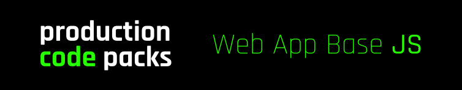

### Overview

**This production code pack is a solid base for a production web app.**

:chart_with_upwards_trend: _Written in the most popular and in demand Javascript technologies._

---

:heavy_check_mark: **Use this pack to build upon** / Had enough of writing and debugging boilerplate code?

Building upon _Web App Base JS_ allows you to get straight to building your actual application instead of first building out the scaffolding that underlies your application, saving you hours if not days or weeks in development time, effort and energy.

---

:heavy_check_mark: **Use this pack to learn from** / Tired of learning from sources that don't go all the way?

Learning from _Web App Base JS_ will teach you how to build an actual production ready web app. Read, run, deconstruct and modify the code.

---

The purpose of this pack is to implement the scaffolding and base of a production web app, therefore we have chosen to ship _Web App Base JS_ with an extremely simple demo application. Switch out this demo application as you build your own, using what's provided as a blueprint.

### :star::star::star: We love crypto :heart:

**If you find this useful in any way, send as much or as little as you like to the following address(es).**

:arrow_right: **BTC** Bitcoin

```
bc1qss44z42z0nzcftgschp6gu9zk6m5t8wp36vypu
```

:arrow_right: **ETH** Ethereum

```
0x6ACf294297d8f417cd46c56D50AC8C36BCB37563
```

:arrow_right: **USDT** Tether on the Ethereum network

```
0x6ACf294297d8f417cd46c56D50AC8C36BCB37563
```

:arrow_right: **USDC** USD Coin on the Ethereum network

```
0x6ACf294297d8f417cd46c56D50AC8C36BCB37563
```

:arrow_right: **BNB** BNB on the BNB network

```
bnb16e2t0g557wz4na5n4py5seuvheegy5e7yvxvsa
```

:arrow_right: **XRP** XRP

```
rDnrpFNm3hLHW1Q8tX4EB3oAfDysQ69XBU
```

:arrow_right: **LTC** Litecoin

```
LRFTZJZssG7P6hgYmUeJfX7HwvYdckmDNs
```

:arrow_right: **ADA** Cardano

```
addr1qye5qd4w67dex5ep9va9h2epvygr4ecltnfafsv27dy5t4engqm2a4umjdfjz2e6tw4jzcgs8tn37hxn6nqc4u6fghtsvy2vt6
```

:arrow_right: **SOL** Solana

```
iHbKzcc2CN3EeJxFHPQN6qouBkFFkBqEgn1TRBADd7p
```

### Notes

+ The setup scripts are for **Ubuntu 16.04**. Check the comments in the files for info in how to modify them for a different OS.
+ Next.JS version is set to **11.1.0**.
+ Axios version is set to **0.25.0**.

### Quick start

**Have it up and running within minutes.**

Download _Web App Base JS_.

> Step 1.

```
git clone https://github.com/productioncodepacks/Web-App-Base-JS
```

Move into the _Web App Base JS_ directory.

> Step 2.

```
cd Web-App-Base-JS
```

Install the database.

> Step 3.
> 
> Install MongoDB. Written for Ubuntu 16.04.

```
cd setup
./setup.sh
```

> Step 3.
> 
> Optionally set up a firewall for MongoDB. Written for Ubuntu 16.04. Read the comments in the file because modifications are required.

```
cd ../firewall
./mongodb.sh
```

> Step 4.
> 
> Edit the URLs in the following files.

```
.env.development
.env.production
```

Install the required NPM packages.

> Step 4.

```
cd ../
npm install
```

Running and deployment.

> Step 5.
> 
> Run in development mode.

```
npm run dev
```

> Step 5.
> 
> Run as a production build.

```
npm run build
npm run start
```

> Step 5.
> 
> Run and deploy a production build over HTTPS using DigitalOcean, Certbot, NGINX and PM2.

```
https://www.digitalocean.com/community/tutorials/how-to-set-up-a-node-js-application-for-production-on-ubuntu-16-04
```
